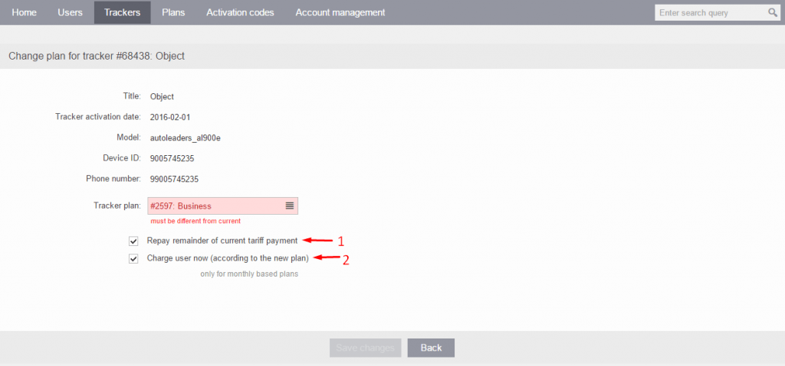

# Cambiar plan

Cambiar el plan de precios para un rastreador en la plataforma Navixy es un proceso sencillo que puede completarse en solo unos pocos pasos a través del Panel de Administración.

## Planes de precios para usuarios

Un plan de precios en Navixy es un conjunto de tarifas y costos que determinan el precio de uso de los servicios de rastreo GPS y monitoreo de la plataforma. Navixy ofrece varios planes de precios con diferentes características y niveles de acceso, permitiendo a los usuarios elegir un plan que mejor se adapte a sus necesidades y presupuesto.

El plan de precios que elija para su cuenta de Navixy determina cuánto se le cobrará a un usuario por acceder a los servicios de la plataforma, como rastreo GPS en tiempo real, gestión de dispositivos y generación de informes. Diferentes planes también pueden ofrecer distintos niveles de acceso y control, como la capacidad de crear sub-usuarios o personalizar informes.

Los planes de precios de Navixy están diseñados para ser flexibles y escalables, permitiendo a los clientes ajustar su plan a medida que sus necesidades cambian con el tiempo. Esto significa que un cliente puede comenzar con un plan básico y actualizar a un plan más avanzado a medida que su negocio crece y las necesidades de gestión de flota o rastreo GPS se vuelven más complejas.

## Cambiar plan de precios

Para cambiar el plan de precios de su rastreador GPS en la plataforma Navixy, siga estos pasos:

1. Haga clic en el botón "Cambiar Plan" ubicado en el lado derecho de la tarjeta del rastreador
2. Esto abrirá una nueva pestaña donde puede asignar el nuevo plan de precios para su rastreador
3. Tendrá la opción de elegir cómo cobrar al usuario con planes basados en mensualidades. Hay dos opciones:
  1. Reembolsar el resto del pago del plan actual: Seleccione esta opción si desea cobrar al usuario (según el plan actual) hasta el final del mes.

- Cobrar al usuario ahora (según el nuevo plan): Seleccione esta opción si desea tomar dinero de la cuenta del usuario según el plan anterior hasta la fecha actual, y luego comenzar a cobrar al usuario según el nuevo plan. Si el usuario tiene un saldo cero, el plan se cambiará, pero todos los servicios serán bloqueados.

Es importante tener en cuenta que al cambiar un plan para un rastreador, el nuevo plan solo entrará en vigor después de que finalice el ciclo de facturación del plan actual. Esto significa que al usuario se le seguirá cobrando según el plan actual hasta el final del ciclo de facturación actual, momento en el cual el nuevo plan entrará en vigor.

Para más detalles sobre Planes, consulte nuestra documentación [aquí](/wiki/pages/createpage.action?spaceKey=APES&title=Plans&linkCreation=true&fromPageId=3365340330).