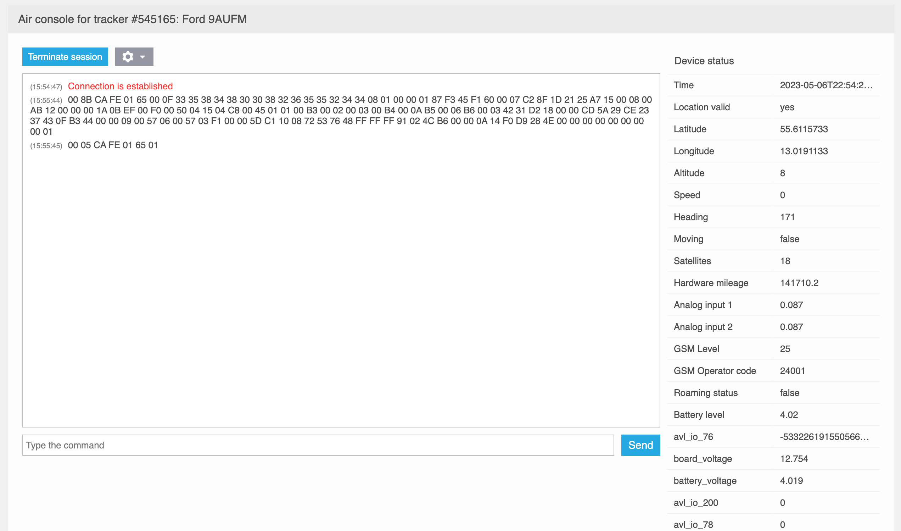

# Air Console

Air Console permite a especialistas técnicos, como miembros del equipo de soporte técnico, monitorear todos los mensajes enviados por el rastreador al servidor y enviar comandos al dispositivo si es compatible. Impulsado por la tecnología WebSocket, Air Console facilita el intercambio de datos en tiempo real sin retraso ni demora.

Navixy Air Console permite a los especialistas técnicos realizar varias tareas, tales como:

- Gestionar configuraciones y ajustes del dispositivo de forma remota
- Verificar estados y ubicaciones del dispositivo en tiempo real
- Enviar comandos de diagnóstico a los dispositivos
- Realizar actualización de firmware OTA y reinicio remoto
- Visualizar datos sin procesar del dispositivo

## Uso de Air Console

Para usar el terminal GPRS, seleccione el rastreador deseado (que debe estar en línea) y luego haga clic en "Terminal GPRS" en el menú derecho. Se abrirá el terminal, donde puede establecer una conexión con el rastreador haciendo clic en el botón "Iniciar conexión".

Hay opciones adicionales que se pueden utilizar:

- El desplazamiento automático es responsable de desplazar automáticamente la consola cuando aparecen nuevos mensajes. Puede deshabilitarlo si está trabajando con un paquete específico o su dispositivo envía mensajes con frecuencia.
- Mostrar hora del mensaje habilita o deshabilita la visualización de la hora del mensaje. La hora se muestra según su zona horaria.
- La opción Mostrar Estado puede ocultar la parte del terminal con información decodificada y dejar solo una ventana para leer mensajes sin procesar y enviar comandos.
- La opción limpiar consola es necesaria para borrar todos los mensajes recibidos.

Cuando la sesión esté completa, haga clic en "Terminar Conexión" para cerrar la conexión.

En el lado izquierdo encontrará una ventana de información que muestra toda la información de su dispositivo en forma sin procesar. Debajo de ella encontrará una línea de comandos donde puede enviar comandos a su dispositivo en la forma proporcionada por el protocolo. Estos comandos se enviarán al dispositivo en la misma forma en que fueron especificados en la línea de comandos.

En el lado derecho, verá el estado del dispositivo y una lista de parámetros decodificados del paquete de datos del dispositivo. Esto puede incluir información sobre velocidad, ubicación, entradas y salidas, nivel de batería, satélites fijos, intensidad de señal y más. Con cada nuevo mensaje, la información de estado se actualizará. Los campos actualizados con los mensajes recibidos más recientemente se marcarán con un triángulo rojo.

## Lectura de estados de entrada y salida

Los datos de estado de entrada y salida se pueden mostrar de dos maneras, dependiendo del protocolo de comunicación del dispositivo. Para leerlos, preste atención al nombre del parámetro responsable del estado de las entradas y salidas.

### Estado de entradas (Set/Reset) y Estado de salidas (Set/Reset)

Cuando se muestra este nombre de parámetro, los estados se mostrarán como \[1RNS\]. Este tipo se usa si el protocolo del dispositivo no prevé enviar el estado de todas las E/S a la vez con un solo valor.

Cada elemento entre paréntesis muestra los siguientes valores:

- Dígito - número de entrada/salida
- S - Set (encendido)
- R - Reset (apagado)

Por ejemplo, si llega el valor \[8S\], significa que la entrada 8 está habilitada y el estado de las otras entradas es desconocido.

Considere el ejemplo adicional de \[1S2R3S\]

- Las entradas 1 y 3 están habilitadas
- La entrada 2 está apagada

### Estado de entrada digital y Estado de salida digital

Este nombre de parámetro se mostrará si el dispositivo envía el estado de todos los dispositivos de E/S a la vez en un campo del paquete. El terminal muestra la información sobre ellos en forma decimal. Es necesario convertir el número decimal a binario y leerlo en formato little-endian (de derecha a izquierda). El último dígito es responsable de la entrada 1, el penúltimo dígito de la entrada 2 y así sucesivamente.

Por ejemplo, la consola muestra el estado de las entradas como 5. En forma binaria es 0101. Debe leerse de derecha a izquierda:

- Entrada 1 - encendida
- Entrada 2 - apagada
- Entrada 3 - encendida
- Entrada 4 (si está presente en el dispositivo - apagada