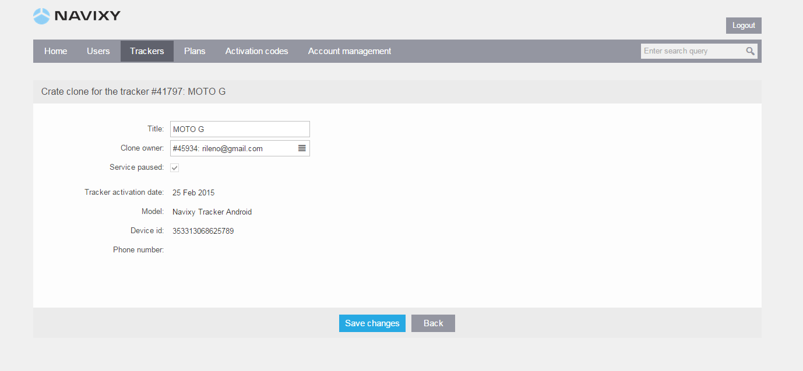
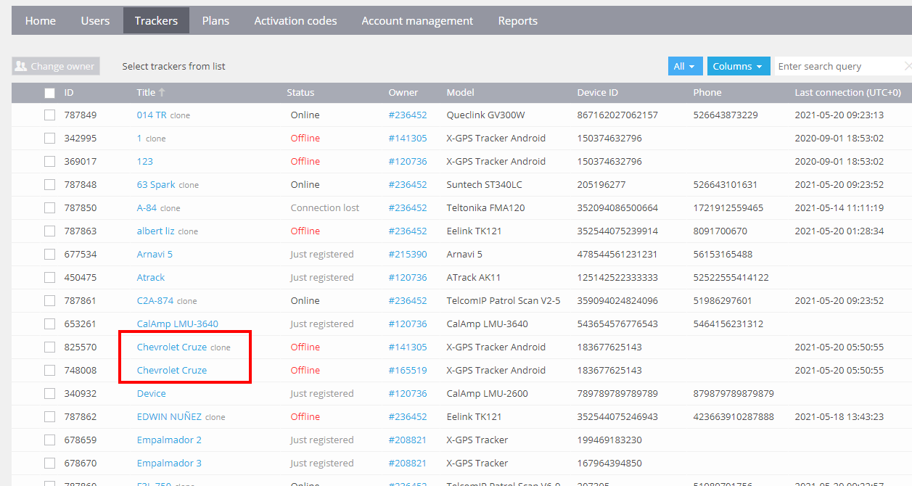

# Clones de rastreadores

Un *clon* es una instancia virtual de un rastreador GPS existente en la plataforma Navixy. Los clones le permiten crear una o más copias de un rastreador existente y colocarlas en múltiples cuentas de usuario independientes. Esto significa que varios usuarios pueden monitorear el mismo rastreador GPS desde sus cuentas individuales.

Clonar un rastreador es una función útil cuando desea proporcionar acceso al mismo rastreador GPS a múltiples usuarios mientras mantiene cuentas de usuario separadas. Por ejemplo, si ha registrado todos sus rastreadores en una cuenta de usuario pero necesita que sus colegas monitoreen y supervisen grupos particulares de rastreadores, puede crear cuentas de usuario separadas para ellos en el Panel de Administración y clonar los rastreadores necesarios en sus cuentas.

Es importante tener en cuenta que clonar un rastreador no es lo mismo que permitir que los sub-usuarios monitoreen el mismo objeto. Con la clonación, el mismo rastreador GPS puede ser monitoreado por usuarios independientes, mientras que los sub-usuarios solo pueden monitorear objetos dentro de la misma cuenta de usuario. En resumen, la clonación en la plataforma Navixy permite a usuarios independientes monitorear el mismo rastreador GPS desde sus cuentas individuales, proporcionando flexibilidad y control sobre quién tiene acceso a la información de seguimiento.

## Diferencia entre rastreadores y clones

Aunque tanto los rastreadores como los clones en la plataforma Navixy se utilizan para monitorear dispositivos GPS, existen algunas diferencias importantes entre ambos.

**Rastreadores**

Un rastreador en la plataforma Navixy es un dispositivo GPS físico que está registrado en la plataforma. El usuario que posee un rastreador puede gestionar y cambiar su configuración y ajustes. Esto incluye cambiar el modo de seguimiento, configurar la detección de estacionamiento y otros ajustes específicos del dispositivo.

**Clones**

Un clon en la plataforma Navixy es una instancia virtual de un rastreador GPS existente. El propietario de un clon tiene acciones limitadas en comparación con el propietario de un rastreador. Un usuario que posee clones solo puede realizar acciones de solo lectura, como monitorear en el mapa o utilizar herramientas de informes. No tienen la capacidad de cambiar ninguna de las configuraciones y ajustes en la aplicación Dispositivos, como el modo de seguimiento, la detección de estacionamiento y otros ajustes.

En resumen, aunque tanto los rastreadores como los clones en la plataforma Navixy se utilizan para el monitoreo de dispositivos GPS, la principal diferencia radica en el nivel de control y acceso que tiene el propietario. El propietario del rastreador tiene control total sobre la configuración y ajustes del dispositivo, mientras que el clon tiene acciones limitadas y no puede cambiar ninguna de las configuraciones y ajustes del dispositivo

## Creación y gestión de clones

Aquí están los pasos para crear y gestionar clones en Navixy:

1. Inicie sesión en el Panel de Administración de Navixy y seleccione el/los rastreador(es) que desea clonar.
2. Haga clic en el botón "Clonar" y asigne un nombre a su clon.
3. Asigne el clon a la cuenta de usuario deseada (es decir, el propietario del clon) seleccionando la cuenta de la lista desplegable.
4. Guarde sus cambios, y el clon será creado y estará listo para ser monitoreado por la cuenta de usuario asignada.

Para gestionar sus clones, simplemente haga clic en el clon que desea editar y haga clic en el botón "Editar Rastreador". Desde allí, puede cambiar el propietario del clon u otros detalles según sea necesario.

También puede clonar un dispositivo entre Paneles de Administración, sin embargo, necesitará comunicarse con el equipo de Soporte para obtener asistencia.

Dado que los clones son reflejos virtuales de los rastreadores, no hay cargos adicionales por crearlos y utilizarlos. Solo se le cobrará por los rastreadores originales, y no por sus clones.