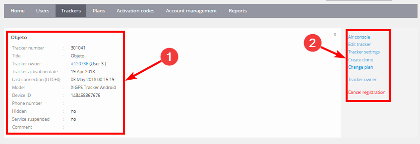
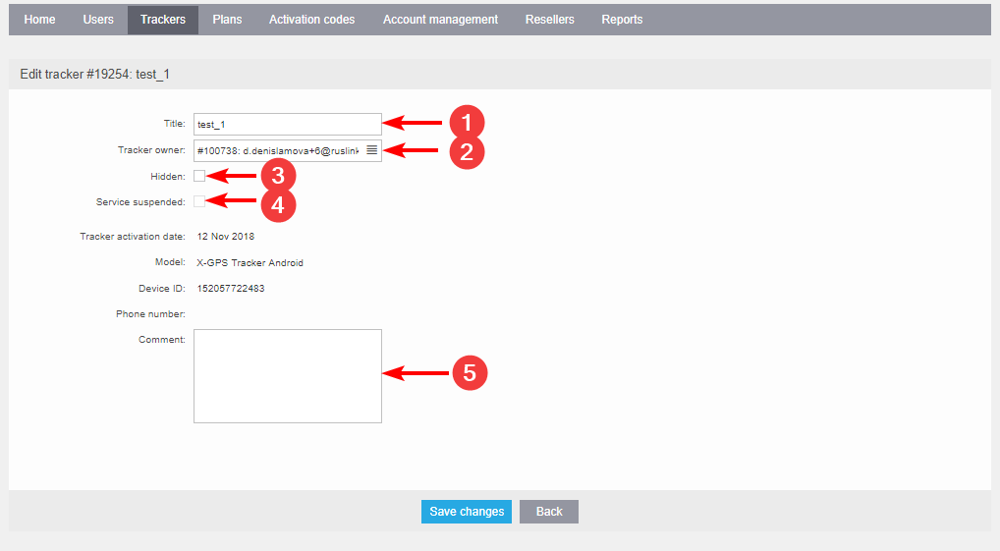

# Operaciones básicas

La pestaña "Rastreadores" en el panel de Administración contiene una lista de todos los rastreadores actualmente registrados en la instancia de Navixy. Cada rastreador se identifica por su ID, título, estado, modelo, ID del dispositivo, número de teléfono y fecha de activación. Utilizando la función de búsqueda rápida, puede encontrar fácilmente el rastreador que está buscando.

## Información del rastreador

Para ver información detallada sobre un rastreador específico, simplemente haga clic en su nombre en la pestaña "Rastreadores". Esto lo llevará a la página de información del rastreador, donde puede encontrar los siguientes detalles:

1. **Información general** - incluye el estado actual del rastreador, la hora de la última actualización del dispositivo, el nivel de batería y otra información relevante.
2. **Menú de herramientas** - el menú le proporciona todas las operaciones disponibles que puede realizar en el rastreador, como configurar ajustes, gestionar usuarios y editar los detalles del rastreador.

## Editar rastreador

En el "Menú de herramientas", puede seleccionar la opción "Editar rastreador" para modificar los parámetros del rastreador. Los siguientes parámetros pueden ser cambiados:

1. **Título** - Puede modificar el nombre del rastreador para identificarlo mejor en la plataforma.
2. **Propietario del rastreador** - Puede asignar el dispositivo a un nuevo usuario.
3. **Oculto** - Si necesita desactivar un rastreador y eliminarlo de la facturación, puede marcar esta casilla. Puede reactivar el rastreador en cualquier momento.
4. **Servicio suspendido** - Si esta opción está marcada, el rastreador seguirá siendo visible en la lista, pero el monitoreo y otras operaciones no estarán disponibles. Esta opción no se puede cambiar y es solo para referencia.
5. **Comentarios** - Puede agregar algunas palabras sobre el rastreador con fines de referencia.

En el panel de Administración de Navixy, la pestaña "Rastreadores" le proporciona una lista completa de todos los rastreadores registrados, junto con su información detallada. Puede acceder al "Menú de herramientas" para realizar varias operaciones en el rastreador, incluyendo la edición de sus parámetros, la gestión de usuarios y la configuración de ajustes. Si tiene alguna pregunta o necesita ayuda con la gestión de sus rastreadores en la plataforma Navixy, por favor contacte a nuestro equipo de soporte para obtener asistencia.