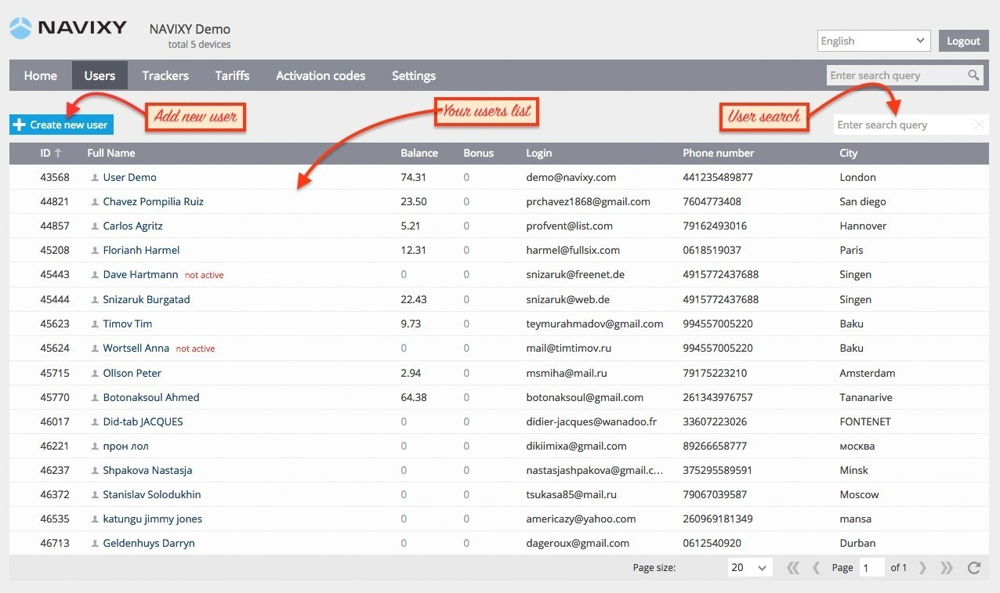
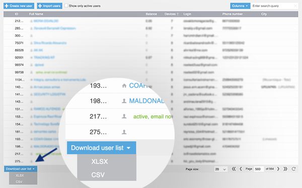

# Usuarios

En la sección [Usuarios](https://panel.navixy.com/#users) puede crear y gestionar cuentas de usuario. La pantalla principal muestra una lista de sus usuarios existentes. Puede añadir, eliminar o editar cuentas fácilmente. Para encontrar un usuario en particular, simplemente utilice el cuadro de búsqueda proporcionado a continuación.

# Exportar lista de usuarios

Gestionar y hacer seguimiento de un gran número de usuarios en la plataforma puede ser un desafío. Para facilitar esta tarea, hemos añadido una función que le permite descargar una lista de sus usuarios en formato CSV o XLSX. Esta característica le permite obtener rápidamente una lista de todos sus usuarios, incluyendo sus direcciones de correo electrónico y números de teléfono.

Los formatos CSV y XLSX son convenientes para importar los datos a CRMs o proveedores de correo sin requerir ninguna edición adicional. Para exportar la lista de usuarios, siga estos pasos:

1. Vaya a la pestaña Usuarios en el panel de administración
2. Desplácese hasta el final de la lista
3. Haga clic en el botón Descargar lista de usuarios y seleccione el formato deseado

La descarga comenzará automáticamente, y podrá utilizar los datos exportados según sea necesario.