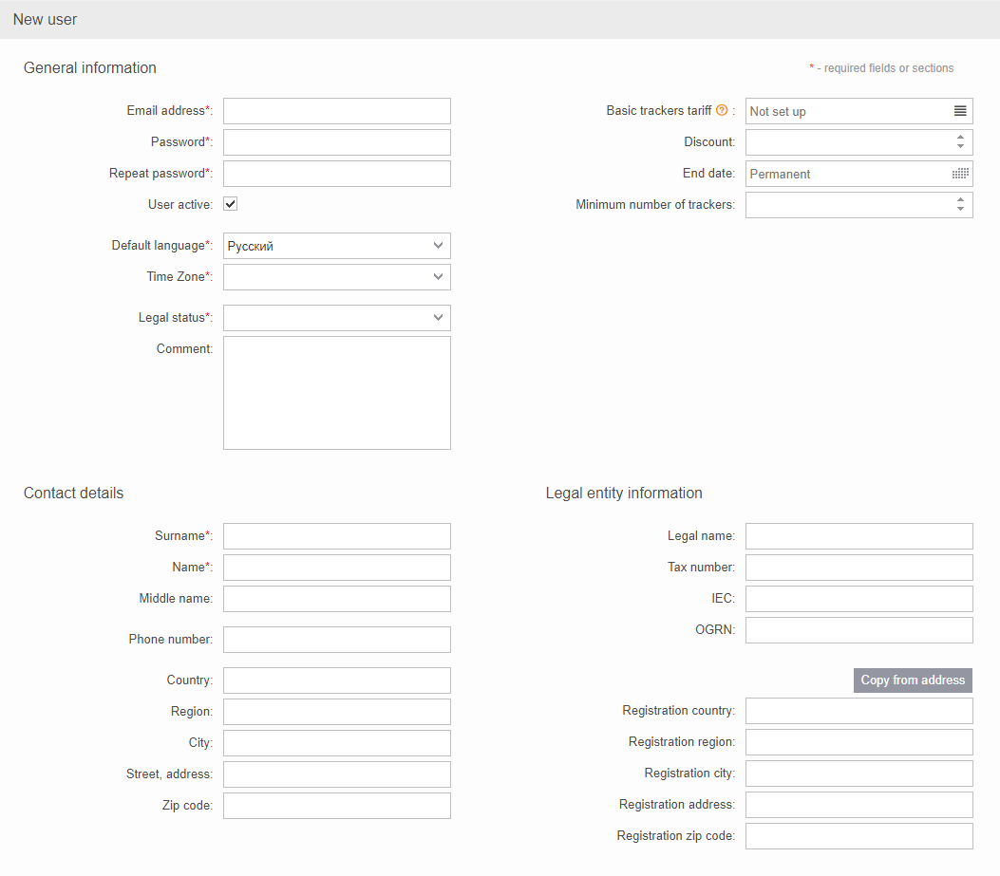
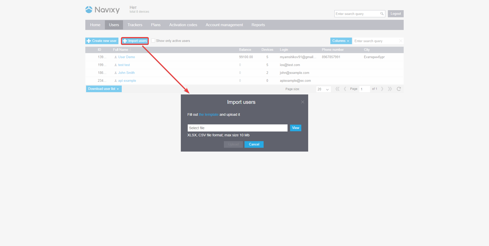

# Crear usuario

## Agregar un usuario manualmente

Al agregar un nuevo usuario desde el panel de Administración, deberá ingresar una dirección de correo electrónico que se utilizará como su inicio de sesión en la plataforma y una contraseña. Además, tiene la opción de ingresar su estado legal, como persona física, entidad legal, autónomo, así como sus datos de contacto y la información de su entidad legal para fines comerciales.

## Importar usuarios desde archivo Excel

Para agregar varios usuarios nuevos a la vez, puede utilizar la función de importación en la pestaña [Usuarios](https://panel.navixy.com/#users). Simplemente haga clic en "Importar Usuarios" y cargue un archivo Excel que contenga los datos de los usuarios. Para asegurarse de que el archivo esté correctamente formateado, puede descargar una plantilla desde la misma ventana o a través de [este enlace](https://panel.navixy.com/app/resources/users_import_template_en.xlsx).

