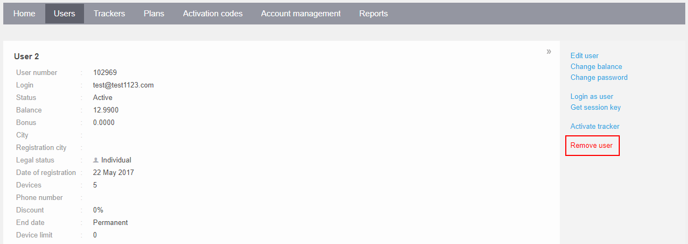

# Eliminar usuario

Cualquier cuenta de usuario puede ser eliminada a través del Panel de Administración haciendo clic en el botón "Eliminar Usuario" en la sección de información del usuario.

Tenga en cuenta que esta operación es irreversible y eliminará permanentemente la cuenta de usuario y todos los datos asociados, incluidos los dispositivos registrados y los sub-usuarios, de la base de datos.

Alternativamente, es posible eliminar una cuenta de usuario a través de la API de Navixy utilizando la llamada [corrupt()](https://developers.navixy.com/panel-api/resources/user/#corrupt).