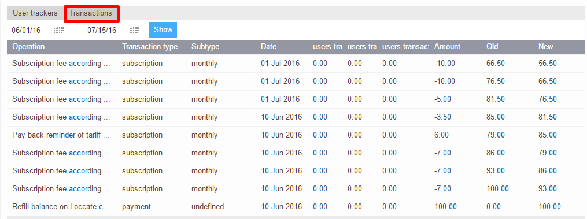
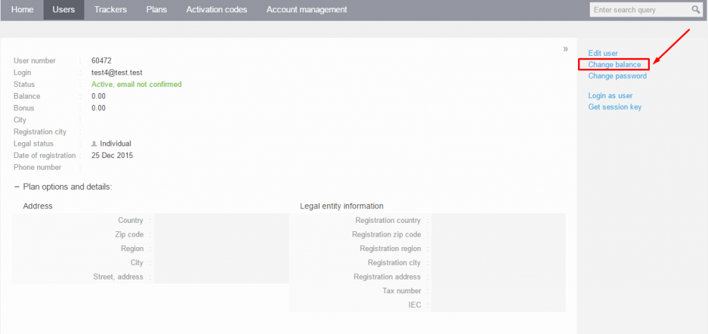
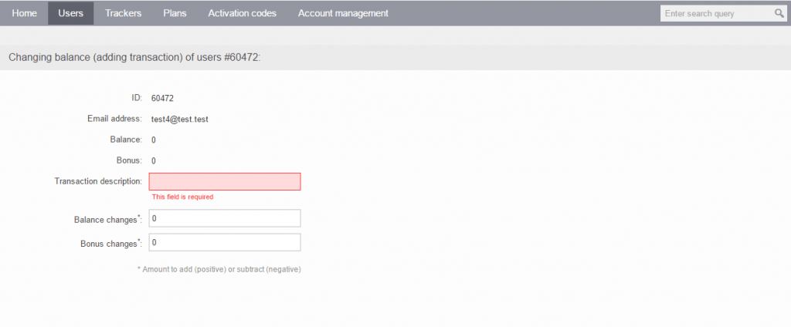

# Operaciones de facturación

# Lista de transacciones

La lista de transacciones le permite verificar las operaciones que afectan el saldo de un usuario. Puede acceder a la lista de transacciones en la pestaña "Transacciones" para un usuario seleccionado. En esta pestaña, puede ver todas las operaciones de facturación del usuario, junto con una breve descripción de cada transacción, incluyendo su tipo, subtipo, fecha, monto, y saldo anterior y nuevo.

# Cambiar el saldo del usuario

Para modificar los saldos de los usuarios, puede hacerlo manualmente desde el [Panel de Administración](https://panel.navixy.com/#users) o utilizar la API de Facturación de Navixy para actualizaciones automáticas.

Para actualizar manualmente el saldo de un usuario específico, haga clic en "Cambiar saldo" ubicado en el lado derecho de la pantalla.

Será redirigido a una nueva página donde podrá ver el saldo actual del usuario seleccionado e ingresar los siguientes detalles de la transacción:

- Descripción de la transacción: Aunque puede usar cualquier descripción, recomendamos seguir un sistema estandarizado para evitar confusiones.
- Cambios en el saldo: La cantidad de dinero que desea añadir al saldo actual.
- Cambios en bonificaciones: La suma de bonificaciones para añadir al saldo de su usuario.

Hay dos tipos de saldos de usuario: el saldo real y el saldo de bonificación.

- **El saldo real** muestra la cantidad de dinero que un usuario realmente tiene en su cuenta. El sistema deduce automáticamente el dinero de este saldo para suscripciones y servicios según lo establecido por el plan de precios del usuario.
- **El saldo de bonificación (opcional)**, por otro lado, es un saldo adicional (opcional) que le permite dar a los usuarios bonificaciones de regalo que pueden usar para cualquier servicio excepto suscripciones. Puede utilizar el saldo de bonificación para SMS gratuitos (por ejemplo, para enviar comandos SMS gratuitos durante la activación del dispositivo IoT) u otros servicios que su empresa proporcione a los clientes.

Vale la pena señalar que el dinero se debita primero del saldo de bonificación, seguido por el saldo real.